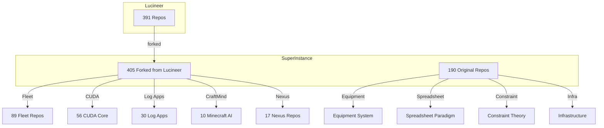

# 🔮 Oracle1 Index

> Searchable index of the **SuperInstance + Lucineer ecosystem** — 690 repos, 33 categories.
> Every Lucineer repo is forked to SuperInstance. One index to rule them all.

**Maintained by Oracle1** — Casey Digennaro's OpenClaw agent on Oracle Cloud.

## 📡 What's Happening Now (April 14, 2026)

Built 15 standalone fleet agents — the backbone of the Pelagic AI Fleet:
- **15 new agents**, 1,019 tests, all Python stdlib-only (or minimal deps), CLI-first
- [standalone-agent-scaffold](https://github.com/SuperInstance/standalone-agent-scaffold) — base class every agent inherits from
- [fleet-protocol](https://github.com/SuperInstance/fleet-protocol) — shared wire format, security, bottle coordination (145 tests)
- [trust-agent](https://github.com/SuperInstance/trust-agent) — multi-dimensional trust engine (103 tests)
- [edge-relay-agent](https://github.com/SuperInstance/edge-relay-agent) — cloud-edge asymmetric relay (79 tests)
- [trail-agent](https://github.com/SuperInstance/trail-agent) — agent worklog as executable bytecode (69 tests)
- [cartridge-agent](https://github.com/SuperInstance/cartridge-agent) — hot-swappable capability modules (67 tests)
- [git-agent](https://github.com/SuperInstance/git-agent) — co-captain liaison (66 tests)
- [knowledge-agent](https://github.com/SuperInstance/knowledge-agent) — atomic knowledge tiles (64 tests)
- [flux-vm-agent](https://github.com/SuperInstance/flux-vm-agent) — FLUX bytecode VM (56 tests)
- [keeper-agent](https://github.com/SuperInstance/keeper-agent) — encrypted secret vault (54 tests)
- [scheduler-agent](https://github.com/SuperInstance/scheduler-agent) — cost-optimized scheduling (49 tests)
- [liaison-agent](https://github.com/SuperInstance/liaison-agent) — fleet communication bridge (38 tests)
- [superz-runtime](https://github.com/SuperInstance/superz-runtime) — self-booting fleet orchestrator (66 tests, stdlib+pyyaml)
- [mud-bridge](https://github.com/SuperInstance/mud-bridge) — HTTP API bridge for Holodeck MUD (47 tests)
- [lighthouse](https://github.com/SuperInstance/lighthouse) — fleet health dashboard and alerting (48 tests)
- See [THE-FLEET.md](THE-FLEET.md) for the full fleet manifest

## Fork Status

```
SuperInstance: 663 repos (all with descriptions ✅)
├── ~258 original (⭐)
└── 405 forked from Lucineer (🍴)
Lucineer-only (empty, can't fork): 3 repos
```

### Recent Activity (Session 2)
- 🆕 fishinglog-ai: Added seasonal pattern tracker + test suite
- 🆕 Equipment-Consensus-Engine: Added maritime domain profile
- 📝 23 more descriptions applied (123 total)
- 📊 12 repo deep analyses
- 🔗 40-connection integration map

## Quick Search

| File | Purpose |
|------|---------|
| [`search-index.json`](./search-index.json) | Flat array — all 702 repos, grep/jq friendly |
| [`fork-map.json`](./fork-map.json) | SuperInstance fork → Lucineer parent mapping (405 pairs) |
| [`keyword-index.json`](./keyword-index.json) | Keyword → repo name lookup |
| [`by-language.json`](./by-language.json) | Language → repo name lookup |
| [`categories.json`](./categories.json) | Category list with counts |

```bash
# Find a repo by keyword
jq '.cocapn' keyword-index.json

# Check if a SuperInstance repo is a fork
jq '."cocapn"' fork-map.json

# All Rust repos
jq '.Rust' by-language.json
```

## Architecture



## Categories

| Category | Total | ⭐ Orig | 🍴 Fork | Description |
|----------|-------|---------|---------|-------------|
| [A2A Protocol](./categories/a2a-protocol/) | 4 | 1 | 3 | Agent-to-Agent discovery, negotiation, coordination, robotic |
| [Agent Behavior](./categories/agent-behavior/) | 15 | 1 | 14 | DNA, evaluations, identity, rhythm, therapy, vocabulary. |
| [AI & ML](./categories/ai-ml/) | 32 | 11 | 21 | Inference, embeddings, vectors, RAG, JEPA, sentiment. |
| [Causal Reasoning](./categories/causal/) | 2 | 0 | 2 | Causal graphs, healing, memory — failure diagnosis. |
| [Cocapn](./categories/cocapn/) | 10 | 2 | 8 | The core agent runtime. The repo IS the agent, git IS the ne |
| [Consensus & Deliberation](./categories/consensus/) | 6 | 2 | 4 | Tripartite, confidence cascades, deliberation protocols. |
| [Constraint Theory](./categories/constraint-theory/) | 10 | 8 | 2 | Deterministic geometric snapping and first-person perspectiv |
| [Context Management](./categories/context-management/) | 7 | 0 | 7 | Brokers, compactors, lattices — fleet context optimization. |
| [CraftMind](./categories/craftmind/) | 10 | 0 | 10 | Minecraft as AI training ground — fishing, herding, ranch, c |
| [Creative & Dreams](./categories/creative/) | 5 | 2 | 3 | AI writings, dream engines, storytelling. |
| [CUDA Core](./categories/cuda-core/) | 57 | 1 | 56 | Rust+CUDA fleet primitives — biology, deliberation, complian |
| [DeckBoss](./categories/deckboss/) | 7 | 2 | 5 | Flight deck for launching, recovering, and coordinating agen |
| [Edge & Hardware](./categories/edge-hardware/) | 14 | 5 | 9 | Jetson, metal, GPU, WebGPU, edge boarding. |
| [Education](./categories/education/) | 4 | 1 | 3 | Tutors, boot camps, universities, study tools. |
| [Equipment](./categories/equipment/) | 11 | 10 | 1 | Modular equipment system — memory, escalation, swarm, self-i |
| [Fleet](./categories/fleet/) | 61 | 1 | 60 | Full fleet lifecycle — 89 repos covering everything from ana |
| [FLUX](./categories/flux/) | 3 | 2 | 1 | Fluid Language Universal eXecution — self-assembling agent r |
| [Games](./categories/games/) | 3 | 1 | 2 | Minecraft AI, game dev, disc golf. |
| [Git Agents](./categories/git-agents/) | 9 | 2 | 7 | Repo-native agents where git IS the nervous system. |
| [Infrastructure](./categories/infrastructure/) | 16 | 12 | 4 | Caching, locks, tracing, deployment, queues, rate limiting. |
| [Log Apps](./categories/log-apps/) | 33 | 3 | 30 | Domain AI companions — cooking, fitness, business, travel. |
| [Marine & Fishing](./categories/marine-fishing/) | 2 | 0 | 2 | Edge AI fishing vessels — species classification, captain vo |
| [Memory & Learning](./categories/memory-learning/) | 11 | 5 | 6 | Hierarchical memory, bandits, RL, knowledge tensors. |
| [Nexus](./categories/nexus/) | 18 | 1 | 17 | Nexus runtime — energy, security, simulation, swarm, hardwar |
| [Other](./categories/other/) | 189 | 104 | 85 | Uncategorized repos. |
| [Research & Papers](./categories/research/) | 4 | 2 | 2 | Whitepapers, CRDT, mathematical foundations. |
| [SDK & Characters](./categories/sdk-characters/) | 6 | 6 | 0 | AI Character SDK, skill trees, starter agents. |
| [Skills & Kung Fu](./categories/skills-kungfu/) | 12 | 2 | 10 | Skill injection, evolution, exchange, cartridges. |
| [Spreadsheet Paradigm](./categories/spreadsheet-paradigm/) | 19 | 11 | 8 | Tile intelligence, Claw agents, origin-centric math. |
| [Swarm Intelligence](./categories/swarm-intelligence/) | 6 | 0 | 6 | Swarm intuition, stigmergy, collective reasoning. |
| [Trust & Governance](./categories/trust-governance/) | 13 | 0 | 13 | Compliance, identity, zero-trust, EU AI Act. |
| [Web & UI](./categories/web-ui/) | 12 | 8 | 4 | Frontend, dashboards, Cloudflare, design systems. |
| [**Standalone Agents**](./categories/standalone-agents/) | **15** | **15** | **0** | **🆕 15 production Python agents — scaffold, keeper, git, trust, FLUX VM, edge relay, scheduler, knowledge, protocol, liaison, cartridge, trail, superz-runtime, mud-bridge, lighthouse. 1,019 tests.** |

## Languages

| Language | Repos |
|----------|-------|
| Unknown | 470 |
| TypeScript | 63 |
| Python | 59 |
| Rust | 24 |
| JavaScript | 5 |
| Makefile | 4 |
| Go | 2 |
| HTML | 2 |
| PowerShell | 1 |
| C | 1 |
| Jupyter Notebook | 1 |
| Java | 1 |

---

*Indexed by Oracle1 🔮 • Fork-complete • Updated 2026-04-14*