# 🔗 Integration Map

How the core repos connect to each other.

## Dependency Graph

```mermaid
graph TD
    deckboss -->|depends| cocapn
    deckboss -.->|integrat| fleet-orchestrator
    cudaclaw -->|depends| SmartCRDT
    bordercollie -->|depends| cudaclaw
    flux-runtime -->|depends| agentic-compiler
    flux-runtime -->|depends| constraint-theory-core
    nexus-edge-runtime -->|extends| flux-runtime
    craftmind -->|depends| ai-character-sdk
    craftmind -->|depends| hierarchical-memory
    ai-character-sdk -.->|integrat| equipment-memory-hierarchy
    equipment-escalation-router -->|depends| ai-character-sdk
    equipment-swarm-coordinator -.->|integrat| equipment-escalation-router
    polln -->|depends| spreadsheet-moment
    cuda-a2a -->|extends| a2a-protocol
    git-agent -->|extends| cocapn
    git-agent -->|depends| baton-ai
    baton-ai -.->|integrat| git-agent
    Baton -.->|integrat| git-agent
    cuda-deliberation -->|depends| tripartite-rs
    cuda-deliberation -->|depends| confidence-cascade
    the-fleet -->|depends| context-broker
    fleet-orchestrator -.->|integrat| the-fleet
    fleet-orchestrator -->|depends| cuda-deliberation
    fleet-orchestrator -->|depends| a2a-protocol
    craftmind-fishing -->|extends| craftmind
    collective-mind -.->|integrat| the-fleet
    fishinglog-ai -->|depends| nexus-edge-runtime
    fishinglog-ai -->|depends| cudaclaw
    cheetahclaws -->|depends| git-agent
    boot-camp -.->|integrat| git-agent
    cocapn-ai -->|extends| cocapn
    Mycelium -.->|integrat| cocapn
    I-know-kung-fu -->|depends| superpowers
    AIR -.->|integrat| cocapn
    fleet-orchestrator -->|depends| a2a-protocol
    git-agent -.->|integrat| cuda-a2a
    polln -->|depends| flux-runtime
    cocapn -.->|integrat| SmartCRDT
    craftmind -.->|integrat| equipment-escalation-router
    fishinglog-ai -->|depends| cuda-deliberation

```

## Connections

| From | Relationship | To | Why |
|------|-------------|-----|-----|
| deckboss | depends | cocapn | Flight deck control interface for the Cocapn agent runtime |
| deckboss | integrates | fleet-orchestrator | Coordinates stateless edge orchestration for agent deployment |
| cudaclaw | depends | SmartCRDT | Orchestrates 10K+ agents using SmartCRDT conflict resolution |
| bordercollie | depends | cudaclaw | Herds local CUDA-based agents managed by Cudaclaw |
| flux-runtime | depends | agentic-compiler | Self-assembling runtime built from compiled markdown bytecode |
| flux-runtime | depends | constraint-theory-core | Uses deterministic geometric snapping for runtime assembly |
| nexus-edge-runtime | extends | flux-runtime | Edge-specific implementation of the Flux runtime bytecode VM |
| craftmind | depends | ai-character-sdk | Autonomous player driven by unified AI character logic |
| craftmind | depends | hierarchical-memory | Requires 6-tier cognitive memory system for autonomous play |
| ai-character-sdk | integrates | equipment-memory-hierarchy | SDK utilizes the 4-tier memory hierarchy for character state |
| equipment-escalation-router | depends | ai-character-sdk | Routes bot/brain/human LLM traffic based on character escalation |
| equipment-swarm-coordinator | integrates | equipment-escalation-router | Swarm logic relies on router for multi-agent task distribution |
| polln | depends | spreadsheet-moment | Visualized agents utilizing spreadsheet tile intelligence |
| cuda-a2a | extends | a2a-protocol | Rust-based GPU implementation of the Agent-to-Agent protocol |
| git-agent | extends | cocapn | Repo-native agent implementation using Cocapn runtime concepts |
| git-agent | depends | baton-ai | Uses generational context handoff for repo-native continuity |
| baton-ai | integrates | git-agent | Context handoff system designed for repo-native agent lifecycle |
| Baton | integrates | git-agent | Context handoff mechanism integrated with repo-native agents |
| cuda-deliberation | depends | tripartite-rs | Multi-agent consensus built on generic tripartite system |
| cuda-deliberation | depends | confidence-cascade | Consensus logic driven by three-zone confidence propagation |
| the-fleet | depends | context-broker | Central coordination requires goal-scoped context management |
| fleet-orchestrator | integrates | the-fleet | Orchestrator manages the fleet coordination system |
| fleet-orchestrator | depends | cuda-deliberation | Fleet decisions rely on multi-agent consensus mechanisms |
| fleet-orchestrator | depends | a2a-protocol | Requires agent negotiation and discovery protocols |
| craftmind-fishing | extends | craftmind | Specific fishing bot implementation of the Minecraft AI |
| collective-mind | integrates | the-fleet | Pattern discovery operates across distributed fleet vessels |
| fishinglog-ai | depends | nexus-edge-runtime | Edge AI species classification runs on the Nexus Edge runtime |
| fishinglog-ai | depends | cudaclaw | Jetson-powered vessel classification coordinated via Cudaclaw |
| cheetahclaws | depends | git-agent | Personal assistant utilizes repo-native agent infrastructure |
| boot-camp | integrates | git-agent | Training system creates living vessels from repo agents |
| cocapn-ai | extends | cocapn | Cloud service wrapper extending the core Cocapn runtime |
| Mycelium | integrates | cocapn | Behavior capture/seeding integrates with agent execution |
| I-know-kung-fu | depends | superpowers | Skill injection framework relies on agentic skills base |
| AIR | integrates | cocapn | Asynchronous synthesis for agent communication |
| fleet-orchestrator | depends | a2a-protocol | Stateless coordination requires agent discovery protocols |
| git-agent | integrates | cuda-a2a | Repo agents use Rust A2A protocol for communication |
| polln | depends | flux-runtime | Spreadsheet agents run on the self-assembling Flux runtime |
| cocapn | integrates | SmartCRDT | Runtime leverages CRDTs for self-improving AI state |
| craftmind | integrates | equipment-escalation-router | Autonomous logic triggers LLM routing for complex decisions |
| fishinglog-ai | depends | cuda-deliberation | Species classification confidence uses Bayesian consensus |

---

*40 connections mapped across 38 repos • Generated by Oracle1 🔮*